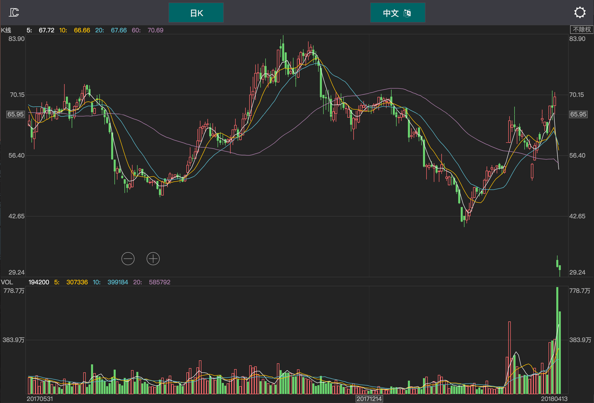
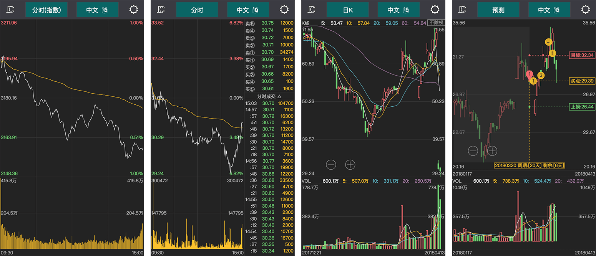
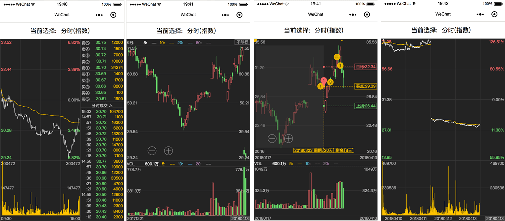
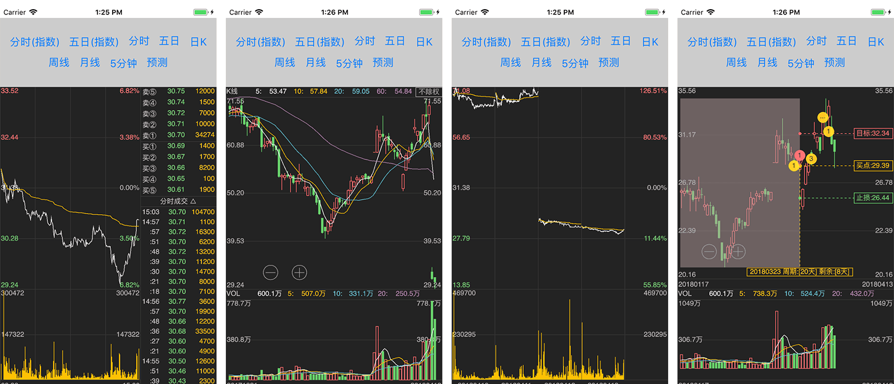

<p align="center"><a href="https://seerline.github.io" target="_blank" rel="noopener noreferrer"></a></p>

# XChart - A Tool for Drawing Stock Graphs

[](https://opensource.org/licenses/MIT)
[](https://standardjs.com)
[](https://www.npmjs.com/package/XChart) [](https://codeclimate.com/github/seerline/XChart)

XChart is a simple cross-platform stock charting tool that utilizes the canvas element.

Try out the [HTML5](https://seerline.github.io/XChart/samples/), or check out the [React Native](https://github.com/seerline/react-native-XChart-demo) and [Wechat Applet](https://github.com/seerline/wechat-applet-XChart-demo) for more examples.

## Installation

### Manual Download

You can download the latest version of `XChart` from the [GitHub releases](https://github.com/seerline/XChart/releases/latest).

### npm

```bash
npm install XChart --save
```

### Build From Source

To build XChart from source, follow these steps:

```shell
git clone git@github.com:seerline/XChart.git
cd XChart
npm install

# Then to build
npm run build
```

## Documentation

Check out the [English documentation](https://seerline.github.io/XChart/) (work in progress) or the [中文文档](https://seerline.github.io/XChart/zh/) (in progress) for more information.

## Contributing

To contribute to XChart, follow these steps:

```shell
git clone https://github.com/seerline/XChart.git
npm install
npm run dev
```

## Screenshots

### PC



### Web



### Mina



### React Native



## Todos

* [ ] Implement karma tests
* [ ] Add more webs
* [ ] Integrate [GCanvas](https://github.com/alibaba/GCanvas) for `react native android`
* [ ] Create a [weex](https://github.com/apache/incubator-weex)
* [x] Integrate WeChat Mina app

## License

XChart is available under the [MIT license](https://opensource.org/licenses/MIT).
